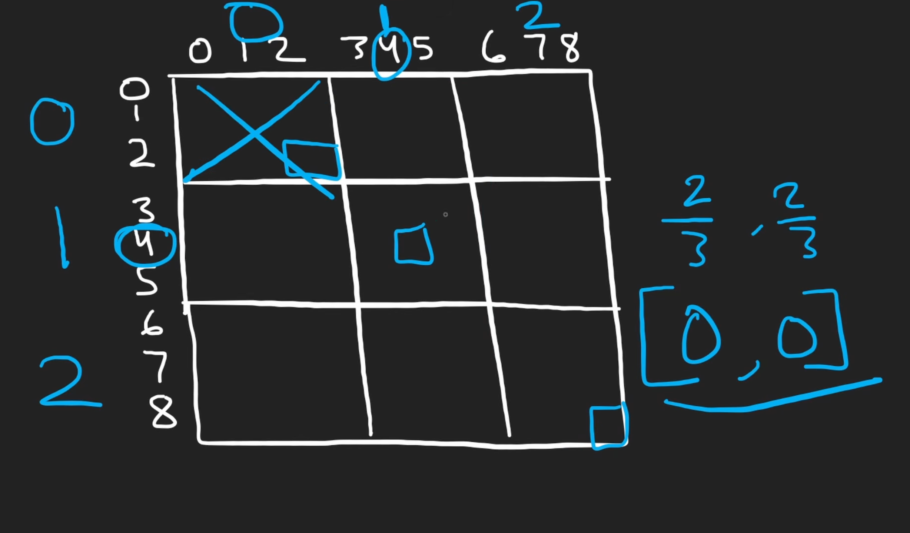

# Valid Sudoku - Medium - Hash Usage

Needed the use of integer division to divide which box the cell belonged too
Must remember to remove unnecessary infomation like "." (easy mistake)

Hardest part was dividing each 3x3 into its own section. Integer division is helpful but to access to infomation I needed to make a `collections.defaultdict(set)` which I'm pretty sure is a dictionary but it automically has a set so I can just see if its inside that 3x3 box without having to index

Diffculity - 8/10

# Video Notes
Prereq: 
    Hash-set - tracks unseen cells
    2d array - navigate through the 2d grid
    bit manipulation - idk

 I forgotted to check the column and row to see if there was any dupe as I got caught into making sure the 3x3 grid didnt have any repetition

 Adding & Checking Dupe of elemeents is time complexity of O(1)
    - We are only checking the 9x9 which is the entire grid we are checking

Overall Solution --
O(9^2) - Memory
Indices to represent which square they belong - integer division

key(r/3, c/3) 
squares[(r//3, c//3)]
